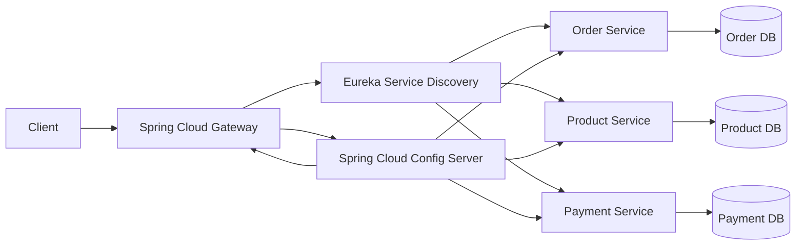

# Spring Cloud Gateway – API Gateway for Microservices

## Overview

This project implements an **API Gateway** using **Spring Boot and Spring Cloud Gateway** to provide a single entry point for multiple microservices.

The gateway is responsible for routing client requests to appropriate backend services and handling cross-cutting concerns like filtering, logging, and request transformation.

---

## Architecture

Client communicate with backend microservices through the API Gateway.

Client → API Gateway → Microservices

## Microservices Architecture




Example routing:

* `/order/**` → Order Service
* `/product/**` → Product Service
* `/payment/**` → Payment Service

---

## Features

* API Gateway using Spring Cloud Gateway
* Dynamic routing to microservices
* Load balancing using service discovery
* Centralized API entry point
* Scalable microservices communication

---

## Tech Stack

* **Java 21**
* **Spring Boot 3+**
* **Spring Cloud Gateway**
* **Spring Cloud Netflix Eureka (Service Discovery)**
* **Maven**
* **REST APIs**
* **Circuit Breaker (Resilience4j)**

---

## Project Structure

```
src
 └── main
     ├── java
     │   └── gateway configuration and filters files
     └── resources
         └── application.yml
```

---

## Sample Gateway Configuration

```yaml
spring:
  cloud:
    gateway:
      routes:
        - id: ORDER-SERVICE
          uri: lb://ORDER-SERVICE
          predicates:
            - Path=/order/**
          filters:
            - StripPrefix=1

        - id: PRODUCT-SERVICE
          uri: lb://PRODUCT-SERVICE
          predicates:
            - Path=/product/**
          filters:
            - StripPrefix=1
        - id: PAYMENT-SERVICE
          uri: lb://PAYMENT-SERVICE
          predicates:
            - Path=/payment/**
          filters:
            - StripPrefix=1
```

---

## How to Run the Project

1. Clone the repository

```
git clone https://github.com/your-username/cloud-gateway.git
(Note: clone or download other microservices repo to run the project)
```

2. Navigate to the project

```
cd cloud-gateway
```

3. Run the application

```
mvn spring-boot:run
```

---

## Use Case

This gateway acts as a **central access point** for all microservices, improving **security, scalability, and maintainability** in a microservices architecture.

---
